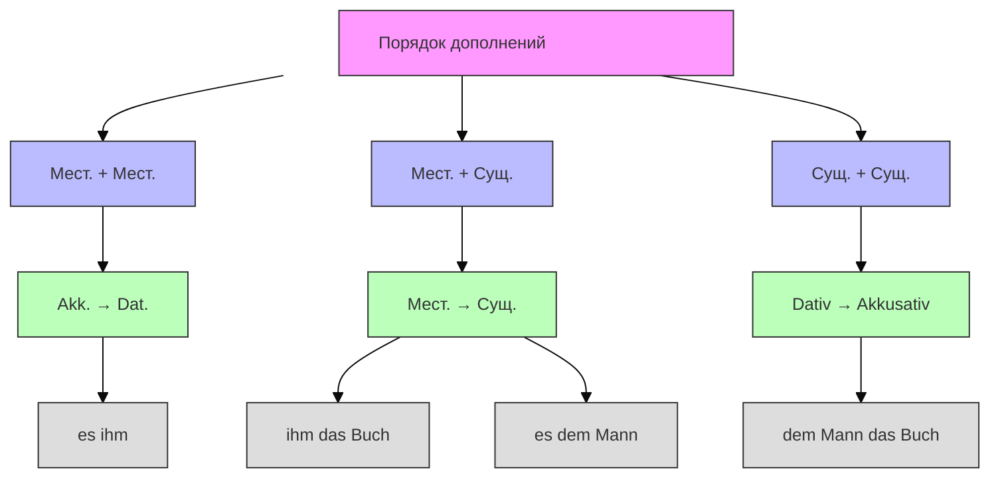

### Правило 1: Местоимения перед существительными

> _Ich gebe **ihm** (D-Pronomen) **das Buch** (A-Substantiv)._  
> _Ich gebe **es** (A-Pronomen) **dem Mann** (D-Substantiv)._

### Правило 2: Если оба — местоимения: Akkusativ перед Dativ

> _Ich gebe **es ihm**._ (Akkusativ-Pronomen → Dativ-Pronomen)  
> _Er schenkt **sie ihr**._ (Akkusativ-Pronomen → Dativ-Pronomen)

### Правило 3: Если оба — существительные: Dativ перед Akkusativ

> _Ich gebe **dem Mann das Buch**._ (Dativ-Substantiv → Akkusativ-Substantiv)