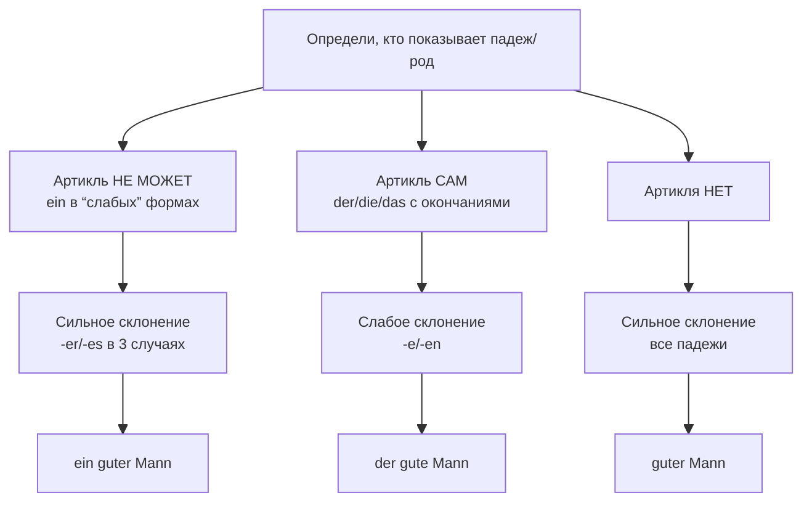

## Gemischte Deklination (ein/mein/kein) - 2

> [!NOTE]
> В случае, когда артикль не показывает сам род и падеж (==подсвечено==), прилагательное берет на себя эту роль (добавляется окончание, как в определенном артикле). 
> В остальных случаях, окончанием будет `-en`.
> 
> Неопределенный артикль (**ein, eine**), отрицательное местоимение (**kein, keine**), притяжательные местоимения (**mein, meine**) показывают род, число и падеж существительного неоднозначно

> [!NOTE] Title
> *[[Indefinitpronomen#==Bestimmte== und Unbestimmte Mengenwörter|Unbestimmte Mengenwörter]]:* **`Einige, wenige, viele, mehrere` - без артикля — это "заместители неопределенного артикля во множественном числе".**
Поэтому они наследуют его **смешанную логику**:
`В Nom./Akk. (главные, "сильные" падежи)` они имеют **уникальную форму** (einige, wenige, viele), и прилагательное после них получает **сильное** окончание **-e**.
`В Dat./Gen. ("слабые" падежи)` их форма не так уникальна (einigen, vielen), и четкий сигнал о падеже дает уже **прилагательное в сильном склонении** (окончания **-en** для Dat., **-er** для Gen.).

> [!CITE] Title
> "~Правило 5 слабых форм (+ 2 для *Unbestimmte Mengenwörter*:)"

|       | **m**                            | **n**                           | **f**                              | **p**                                                                        |
| ----- | -------------------------------- | ------------------------------- | ---------------------------------- | ---------------------------------------------------------------------------- |
| **N** | ==**ein**== **großer** *Hund* | ==**ein**== **altes** *Haus* | ==**eine**== **schöne** *Blume* | **meine großen**   _Häuser_   **`viele` ==`neue`==**   _Bücher_  |
| **A** | **einen großen** *Hund*       | ==**ein**== **altes** *Haus* | ==**eine**== **schöne** *Blume* | **meine großen**   _Häuser_    **`viele` ==`neue`==**   _Bücher_ |
| **D** | **einem großen** *Hund*       | **einem alten** *Haus*       | **einer schönen** *Blume*       | **meinen großen**   _Häusern_    **`vielen neuen`**   _Büchern_  |
| **G** | **eines großen** *Hundes*     | **eines alten** *Hauses*     | **einer schönen** *Blume*       | **meiner großen**   _Häuser_    **`vieler neuer`**   _Bücher_    |

---

## Schwache Deklination (der/die/das) - 1

> [!NOTE]
> То же самое по схеме, что и в смешанном склонении, но окончание будет ==-e==.
> 
> Сопровождающее слово имеется и всегда однозначно показывает род, падеж и число. В роли сопровождающих слов могут выступать определенный артикль **(der, die, das**), указательное местоимение (**dieser, diese, dieses**), вопросительные слова (**welche**), то есть те слова, которые уже в Nominativ, определяют род существительного.

> [!NOTE] Title
> *[[Indefinitpronomen#==Bestimmte== und Unbestimmte Mengenwörter|Bestimmte Mengenwörter]]* :`alle`, `sämtliche` и `beide` во всех падежах прилагательные получают нейтральное окончание `–en`

> [!CITE] Title
> "~Правило 5 слабых форм"

|         | **m**                       | **n**                      | **f**                         | **p**                                                          |
| ------- | --------------------------- | -------------------------- | ----------------------------- | -------------------------------------------------------------- |
| **Nom** | ==**der große** *Hund*== | ==**das alte** *Haus*== | ==**die schöne** *Blume*== | **die großen** *Häuser*  **`alle guten`** *Freunde*   |
| **Akk** | **den großen** *Hund*    | ==**das alte** *Haus*== | ==**die schöne** *Blume*== | **die großen** *Häuser*  **`alle guten`** *Freunde*   |
| **Dat** | **dem großen** *Hund*    | **dem alten** *Haus*    | **der schönen** *Blume*    | **den großen** *Häusern*  **`allen guten`** *Freunde* |
| **Gen** | **des großen** *Hundes*  | **des alten** *Hauses*  | **der schönen** *Blumes*   | **der großen** *Häuser*  **`aller guten`** *Freunde*  |

---
## Starke Deklination (-) - 3

> [!NOTE]
> Окончание как у определенного артикля в соответствующем падеже, обратить внимание на Genetiv: **Maskulin** и **Neutral**. За счет окончания -es. ставим -en, так как ясна форма.
> 

|               | **m**                  | **n**                 | **f**                   | **p**                   |
| ------------- | ---------------------- | --------------------- | ----------------------- | ----------------------- |
| **Nominativ** | ==**großer** *Hund*==   | ==**altes** *Haus*==   | ==**schöne** *Blume*==   | ==**große** *Häuser*==   |
| **Akkusativ** | ==**großen** *Hund*==   | ==**altes** *Haus*==   | ==**schöne** *Blume*==   | ==**große** *Häuser*==   |
| **Dativ**     | ==**großem** *Hund*==   | ==**altem** *Haus*==   | ==**schöner** *Blume*==  | ==**großen** *Häusern*== |
| **Genetiv**   | ==**großen** *Hundes*== | ==**alten** *Hauses*== | ==**schöner** *Blumes*== | ==**großer** *Häuser*==  |
