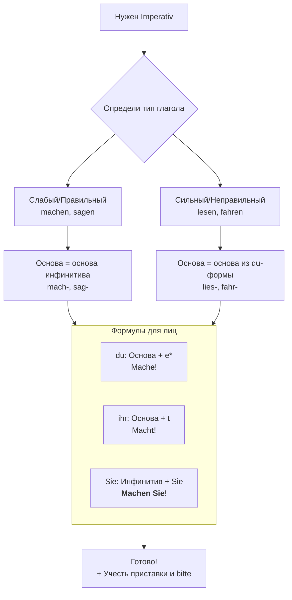

Я напишу **общее и понятное правило для Imperativ в немецком языке**, структурированное для занесения в базу знаний (например, в Obsidian). Правило будет разбито на ключевые блоки для удобства использования.

---

### **📌 Немецкий Imperativ (Повелительное наклонение): Общее правило**

#### **1. Логика и использование**
Imperativ используется для **прямых просьб, приказов, инструкций и советов**. В немецком есть формы для трех лиц:
*   **du** (неформальное «ты») → к одному человеку
*   **ihr** (неформальное «вы») → к нескольким знакомым
*   **Sie** (вежливое/официальное «Вы») → к одному или нескольким людям уважительно
*   **Wir** (призыв к совместному действию) → «давай(те)»

---

#### **2. Алгоритм образования (шаг за шагом)**

**Шаг 1: Найти основу глагола**
*   От инфинитива отнять окончание **-en** (иногда **-n**).
    *   `machen` → mach-
    *   `gehen` → geh-
    *   `lesen` → les- / lies- (см. Шаг 2)

**Шаг 2: Определить тип глагола (ключевой момент!)**
*   **Глагол сильный (неправильный) и меняет гласную в `du`-форме Präsens?**
    *   **Да** → Для `du` в Imperativ **используй измененную основу** из `du`-формы (без `-st`).
        *   `lesen` → du **liest** → **Lies!** (Читай!)
        *   `fahren` → du **fährst** → **Fahr(e)!** (Поезжай!)
    *   **Нет** → Для `du` в Imperativ **используй обычную основу** из инфинитива.

**Шаг 3: Применить формулу для каждого лица**

| Лицо | Формула | Пример: `machen` | Пример: `lesen` (сильный) |
| :--- | :--- | :--- | :--- |
| **du** | Основа (+ **-e**) | **Mach(e)!** (Делай!) | **Lies!** (Читай!) |
| **ihr** | Основа + **-t** | **Macht!** (Делайте!) | **Lest!** (Читайте!) |
| **Sie** | Инфинитив + **Sie** | **Machen Sie!** (Делайте!) | **Lesen Sie!** (Читайте!) |
| **wir** | Инфинитив + **wir** | **Machen wir!** (Давайте сделаем!) | **Lesen wir!** (Давайте почитаем!) |

---

#### **3. Важные исключения и нюансы (ТРИГГЕРЫ ДЛЯ ЗАПОМИНАНИЯ)**

*   **Окончание `-e` для `du`:**
    *   **Можно опустить** в разговорной речи, если основа глагола оканчивается легко (`Geh!`, `Mach!`, `Schlag!`).
    *   **НЕЛЬЗЯ опустить**, если основа оканчивается на:
        *   **-d**, **-t**: `Warte!` (Жди!), `Arbeite!` (Работай!)
        *   **-ig**: `Entschuldige!` (Извини!)
        *   **-m**, **-n** (если перед ними согласная, кроме -l, -r): `Atme!` (Дыши!)
        *   **-s**, **-ß**, **-x**, **-z**: `Heiße!` (Назовись!), `Tanze!` (Танцуй!)

*   **Глаголы-исключения:**
    *   `sein` (быть): **Sei!** (du), **Seid!** (ihr), **Seien Sie!** (Sie)
    *   `werden` (становиться): **Werde!** (du), **Werdet!** (ihr), **Werden Sie!** (Sie)
    *   `wissen` (знать): **Wisse!** (редко, обычно используют `Sie`-форму)

*   **Глаголы с отделяемыми приставками:** Приставка **уходит в конец**.
    *   `aufstehen` → **Steh auf!** (Вставай!)
    *   `zumachen` → **Mach zu!** (Закрывай!)

---

#### **4. Позиция «bitte» (пожалуйста)**
*   Для усиления вежливости `bitte` ставится:
    *   **В начале или в конце** (немного настойчивее): `Bitte, komm!` / `Komm bitte!`
    *   **После глагола** в `Sie`-форме (чаще всего): `Machen Sie **bitte** die Tür zu.`

---

### **📚 Пример-сводка для Obsidian (Mermaid-схема)**

