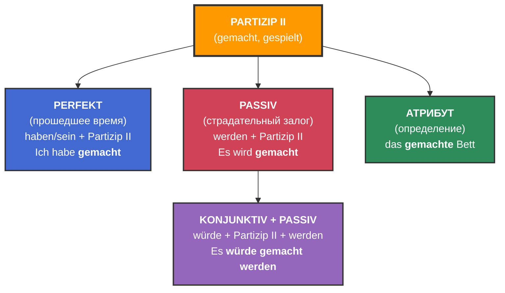

	
*Partizip II (причастие прошедшего времени): gelesen (прочитанный), gespielt (сыгранный).*

### **Когда используется Partizip II:**

#### 1. **Perfekt / Plusquamperfekt**

> _Ich habe **gearbeitet**._  
> _Sie ist **gegangen**._

#### 2. **Passiv** (Vorgangspassiv)

> _Das Haus wird **gebaut**._  
> _Der Brief wurde **geschrieben**._

